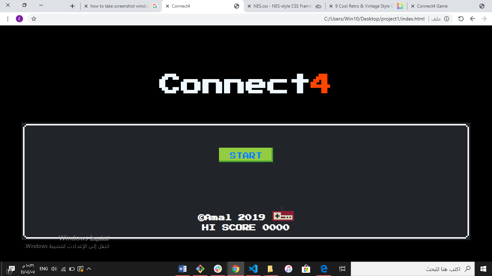

Connect 4:

This is my first project of SEI with GA. 
the goal is to create this game from scratch and having fun while doing that. ^^
It was definitely a challange.

what is the logic of this game?

well, Connect4 is a two-player game in which  players take turns to click on one circle  from the top and all the pieces fall straight down and taking the lowest available space in a column. The main goal here is to be the first to form a horizontal, vertical, or diagonal line of four of one's own color, other wise it is a tie.

Features:
The game include the following features..
- Two players (red/yellow)
- keeping score
- a message after each turn, win and tie
- restart the game without refreshing the page
- cool, retro game style
- awesome audio 

Created with:
html
css / NES.css library
js
jQuery

The code:
created seprate html, css, js file.

how solved for the winner?
I used a function with if statment to check all rows, columns and diagonal to find match. I do relize it is not the best way, but I am welling to work on it to find a better, shorter and more elegant way.

Favorite part?
using jQuery was so much fun. 

css library:
https://nostalgic-css.github.io/NES.css/#